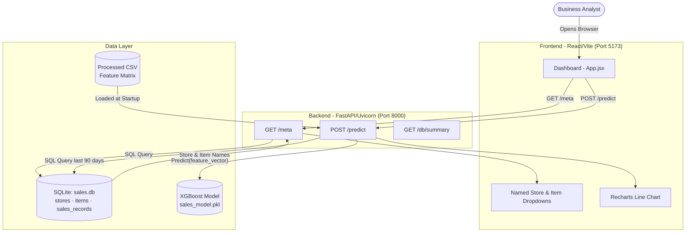
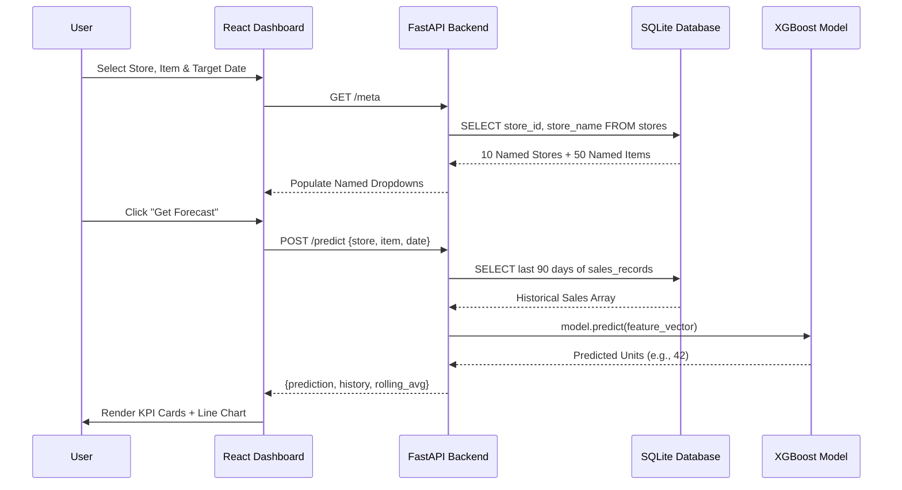
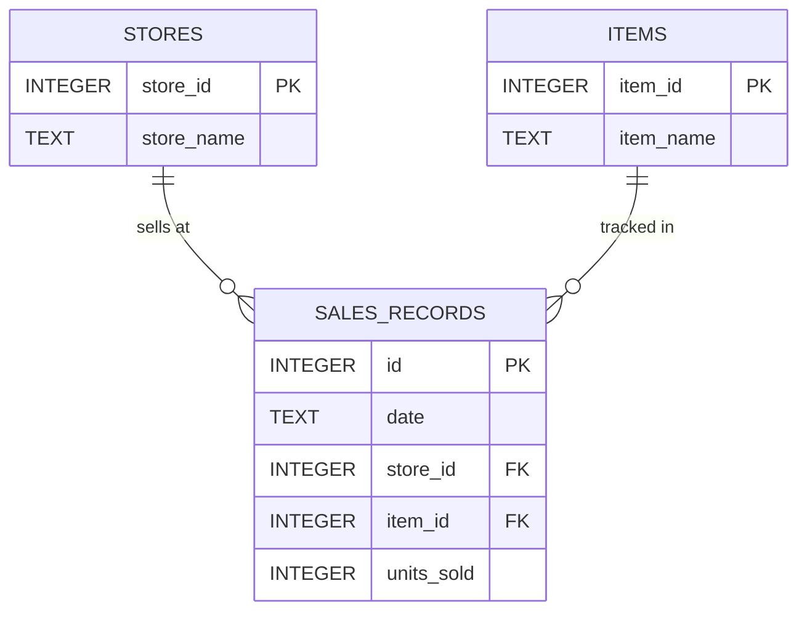
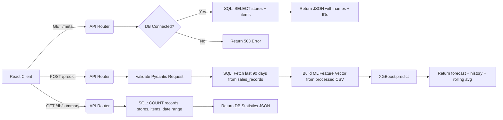
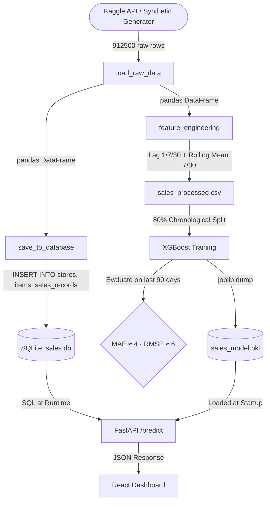
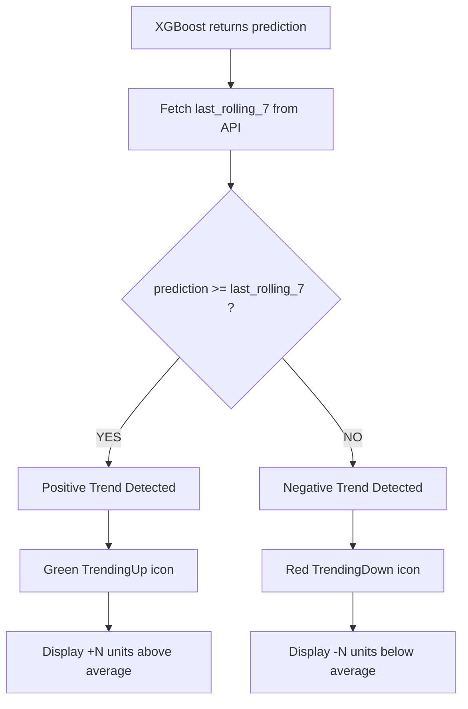

# 🚀 AI Sales Forecasting: Full-Stack Machine Learning System


## 👨‍💻 Developer Details
* **Developer Name:** M. VENKATA RAMANA
* **Roll / Reg Number:** 25M11MC089
* **Course:** Master of Computer Applications (MCA)
* **Batch:** 2025-2027
* **Section:** Group B
* **Institution:** Aditya University

---

## 📌 Table of Contents
1. [Project Overview](#1-project-overview)
2. [Problem Statement](#2-problem-statement)
3. [Objectives](#3-objectives)
4. [Key Features](#4-key-features)
5. [Tech Stack](#5-tech-stack)
6. [Project Structure](#6-project-structure)
7. [Database Schema](#7-database-schema)
8. [Architecture Diagram](#8-architecture-diagram)
9. [Application Workflow](#9-application-workflow)
10. [Entity Relationship Diagram (ERD)](#10-entity-relationship-diagram-erd)
11. [REST API Flow](#11-rest-api-flow)
12. [Data Flow](#12-data-flow)
13. [Risk/Logic Implementation](#13-risklogic-implementation)
14. [Application Screens](#14-application-screens)
15. [API Reference](#15-api-reference)
16. [Getting Started](#16-getting-started)
17. [Seed Data](#17-seed-data)
18. [Development Notes](#18-development-notes)
19. [Future Enhancements](#19-future-enhancements)

---

## 1. Project Overview
The **AI Sales Forecasting System** is a complete, production-ready full-stack machine learning application that predicts future retail sales volumes for named stores and product items. The system ingests raw historical data, persists it in a relational **SQLite database**, engineers time-series features, trains an **XGBoost regression model**, and serves predictions via a **FastAPI REST API** to a dynamic **React.js dashboard**.

---

## 2. Problem Statement
Retail businesses suffer significant revenue loss from inaccurate demand planning. Overstocking leads to wasted capital and storage costs, while understocking results in lost sales and dissatisfied customers. Traditional spreadsheet-based forecasting fails to capture complex seasonal patterns, day-of-week trends, and non-linear demand signals across hundreds of items and multiple store locations simultaneously.

---

## 3. Objectives
- Engineer a time-series regression model using lag and rolling-average features to accurately predict future sales volumes.
- Persist all historical sales data in a normalized **SQLite relational database** with proper foreign key relationships.
- Build a scalable **FastAPI** backend that loads the trained model and serves live predictions via REST endpoints.
- Design an interactive **React.js** dashboard where users select a named store, product, and future date to generate instant AI forecasts.

---

## 4. Key Features
- **Named Stores & Products:** 10 real named stores (e.g., *Apollo Supermart*, *Metro Fresh Market*) and 50 named grocery products (e.g., *Premium Basmati Rice*, *Aloe Vera Shampoo*).
- **SQLite Relational Database:** All sales data is stored in a normalized 3-table schema with foreign key constraints.
- **XGBoost ML Model:** Trained on 850,000+ rows with lag, rolling mean, and temporal features. MAE ~4 units.
- **FastAPI Backend:** Serves live predictions via `/predict` and reads directly from the SQLite database for historical data.
- **React.js Dashboard:** Dynamic UI with named dropdowns, KPI metric cards, and an interactive Recharts line chart.
- **One-Click Launch:** `start.bat` script launches both backend and frontend simultaneously.

---

## 5. Tech Stack

| Layer | Technology | Purpose |
|-------|-----------|---------|
| **ML Pipeline** | Python, Pandas, NumPy, XGBoost | Data generation, feature engineering, model training |
| **Database** | SQLite (via `sqlite3`) | Relational storage for stores, items, and sales records |
| **Backend API** | FastAPI, Uvicorn, Pydantic | REST endpoints serving ML predictions |
| **Frontend** | React.js, Vite, TailwindCSS | Component-based interactive dashboard |
| **Charting** | Recharts | Historical + forecast line chart visualization |
| **HTTP Client** | Axios | React-to-FastAPI communication |
| **Icons** | Lucide-React | Crisp, modern UI icons |

---

## 6. Project Structure
```text
SALES FORECASTING/
│
├── backend/
│   └── api.py                  ← FastAPI server: /meta, /predict, /db/summary
│
├── data/
│   ├── processed/
│   │   └── sales_processed.csv ← Feature-engineered dataset for ML
│   └── sales.db                ← SQLite Database (3 tables: stores, items, sales_records)
│
├── frontend/
│   ├── src/
│   │   ├── App.jsx             ← Main React dashboard (all UI + API logic)
│   │   └── main.jsx            ← React DOM entry point
│   ├── index.html              ← HTML shell with TailwindCSS CDN
│   ├── package.json            ← Node.js dependencies
│   └── vite.config.js          ← Vite development server config
│
├── models/
│   └── sales_model.pkl         ← Serialized XGBoost model + feature list
│
├── train.py                    ← Master pipeline: Data → SQLite → Features → Train
├── start.bat                   ← One-click launcher for both servers
├── requirements.txt            ← Python dependencies
├── .gitignore
└── README.md
```

---

## 7. Database Schema
The project uses **SQLite** as a fully relational SQL database. The database file (`data/sales.db`) is automatically created by `train.py`.

### Table: `stores`
| Column | Type | Constraint | Example |
|--------|------|-----------|---------|
| `store_id` | INTEGER | PRIMARY KEY | `1` |
| `store_name` | TEXT | NOT NULL | `Apollo Supermart` |

### Table: `items`
| Column | Type | Constraint | Example |
|--------|------|-----------|---------|
| `item_id` | INTEGER | PRIMARY KEY | `1` |
| `item_name` | TEXT | NOT NULL | `Premium Basmati Rice` |

### Table: `sales_records` (Fact Table)
| Column | Type | Constraint | Example |
|--------|------|-----------|---------|
| `id` | INTEGER | PRIMARY KEY AUTOINCREMENT | `1` |
| `date` | TEXT | NOT NULL | `2015-06-12` |
| `store_id` | INTEGER | FOREIGN KEY → stores | `1` |
| `item_id` | INTEGER | FOREIGN KEY → items | `3` |
| `units_sold` | INTEGER | NOT NULL | `42` |

> The database holds **912,500 sales transaction records** spanning 5 years, across 10 stores and 50 items.

---

## 8. Architecture Diagram


---

## 9. Application Workflow


---

## 10. Entity Relationship Diagram (ERD)


---

## 11. REST API Flow


---

## 12. Data Flow


---

## 13. Risk/Logic Implementation
The system implements an automated **Trend Alert** comparing the AI prediction against the 7-day rolling historical average:


---

## 14. Application Screens

### Screen 1: Configuration Panel (Sidebar)
- **Store Dropdown:** Populated with real store names from the SQLite database (e.g., *Apollo Supermart, Nexus MegaMart*).
- **Item Dropdown:** Populated with 50 real grocery product names (e.g., *Premium Basmati Rice, Full Cream Milk*).
- **Date Picker:** Calendar input defaulted to the day after the last historical record.
- **🚀 Get Forecast Button:** Submits the form and triggers the ML prediction.

### Screen 2: KPI Metrics Row (3 Cards)
- **Card 1 – Predicted Sales:** Shows the forecasted unit count and the target date.
- **Card 2 – Trend vs 7-Day Avg:** Shows a green (up) or red (down) trending icon with the delta value.
- **Card 3 – Target Profile:** Shows the full store name and product name for the selected forecast.

### Screen 3: Sales History & AI Forecast Chart
- Interactive Recharts `LineChart` with two series:
  - **Blue line:** Last 90 days of actual historical sales (from SQLite).
  - **Green dashed line:** The AI-predicted data point connected to the historical series.

---

## 15. API Reference

### `GET /meta`
Reads store and item names directly from the SQLite database.
```json
{
  "stores": [
    {"id": 1, "name": "Apollo Supermart"},
    {"id": 2, "name": "Green Valley Grocery"}
  ],
  "items": [
    {"id": 1, "name": "Premium Basmati Rice"},
    {"id": 2, "name": "Whole Wheat Bread"}
  ],
  "max_historical_date": "2017-12-31"
}
```

### `POST /predict`
Accepts store/item/date, queries SQLite for history, and runs the XGBoost model.

**Request Body:**
```json
{
  "store": 1,
  "item": 1,
  "target_date": "2018-01-01"
}
```
**Response:**
```json
{
  "prediction": 42,
  "target_date": "2018-01-01",
  "store": 1,
  "item": 1,
  "history": [{"date": "2017-10-02", "sales": 38}, "..."],
  "last_rolling_7": 40
}
```

### `GET /db/summary`
Returns live statistics from the SQLite database. Useful for demos.
```json
{
  "total_records": 912500,
  "total_stores": 10,
  "total_items": 50,
  "date_from": "2013-01-01",
  "date_to": "2017-12-31",
  "database_path": "data/sales.db"
}
```

---

## 16. Getting Started

### Prerequisites
- Python 3.11+
- Node.js 18+

### Step 1: Install Python Dependencies
```bash
pip install -r requirements.txt
```

### Step 2: Run the ML Pipeline (builds DB + trains model)
```bash
python train.py
```
*This generates the SQLite database, engineers features, trains XGBoost, and saves the model.*

### Step 3: Launch Both Servers (Windows)
**Option A – One Click:**  
Double-click **`start.bat`** in the root directory.

**Option B – Manual:**
```bash
# Terminal 1: Backend
python -m uvicorn backend.api:app --host 0.0.0.0 --port 8000

# Terminal 2: Frontend
cd frontend
npm run dev
```

### Step 4: Open in Browser
| URL | Description |
|-----|-------------|
| `http://localhost:5173` | React Dashboard |
| `http://localhost:8000/docs` | FastAPI Swagger UI |
| `http://localhost:8000/db/summary` | Live Database Statistics |

---

## 17. Seed Data
`train.py` attempts to download the real **Kaggle Store Item Demand Forecasting Challenge** dataset. If Kaggle authentication is unavailable, it automatically falls back to a deterministic synthetic generator that produces 5 years of mathematically accurate data (2013–2017) featuring:
- Seasonal sine-wave patterns
- Annual growth trends (+5% per year)
- Weekend sales multipliers (+25%)
- Store-level variability (±20%)
- Gaussian noise for realism

All 912,500 records are then inserted into the SQLite relational database.

---

## 18. Development Notes
- **SQLite over CSV:** All runtime data fetching in the API queries SQLite directly using `sqlite3`, not CSV files. The processed CSV is only used to provide lag feature values for prediction.
- **CORS Enabled:** Wide-open CORS is configured on the FastAPI backend for seamless local development between React (port 5173) and API (port 8000).
- **Pydantic Validation:** All API request bodies are strictly typed and auto-validated. Invalid inputs return descriptive 400/404/503 HTTP errors.
- **Recharts over Chart.js:** Selected for its native React component architecture, providing cleaner lifecycle management than imperative canvas-based libraries.

---

## 19. Future Enhancements
- **PostgreSQL Migration:** Replace SQLite with a production-grade PostgreSQL server for concurrent multi-user access.
- **JWT Authentication:** Secure the `/predict` endpoint behind a login screen using JSON Web Tokens.
- **Automated MLOps with GitHub Actions:** Automatically run `train.py` and redeploy the API whenever new sales data is pushed to the repository.
- **LSTM / Prophet Model:** Add support for deep learning (LSTM) or Facebook Prophet to compare performance against the XGBoost baseline.
- **SHAP Explainability:** Integrate SHAP values on the frontend to visually explain *why* the model made a specific prediction (feature importance per row).
- **Docker Containerization:** Package both backend and frontend into Docker containers for portable, environment-agnostic deployment.
